# Munix 앱 동작 구조

> Mermaid 다이어그램으로 정리한 현재 Munix의 런타임 구조 문서.
> 구현 기준은 `munix/src`와 `munix/src-tauri/src`의 현재 구조다.
> 최신 플랫폼별 runtime 경계는 [app-runtime-architecture.md](./app-runtime-architecture.md)를 기준으로 한다.

## 1. 전체 계층

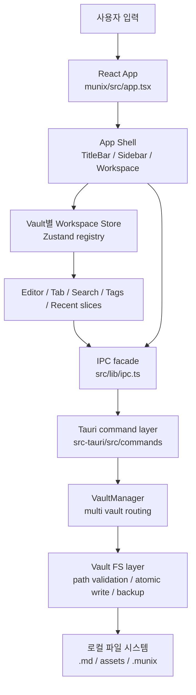

핵심은 프론트가 파일 시스템에 직접 접근하지 않는다는 점이다. 모든 vault 파일 작업은 `ipc.ts`를 거쳐 Rust command와 `Vault` 모듈에서 검증된다.

## 2. 앱 부팅과 Vault 선택

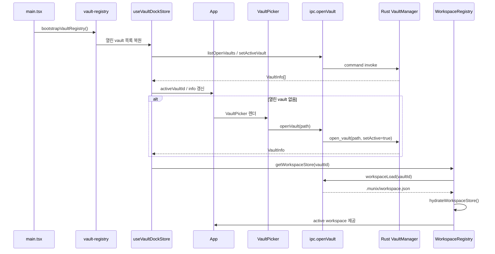

`useVaultStore`는 단일 vault 시절 API 호환용 wrapper 역할을 하고, 실제 멀티 vault 상태의 중심은 `useVaultDockStore`와 `WorkspaceRegistry`다.

## 3. Workspace / Pane / Tab 렌더링

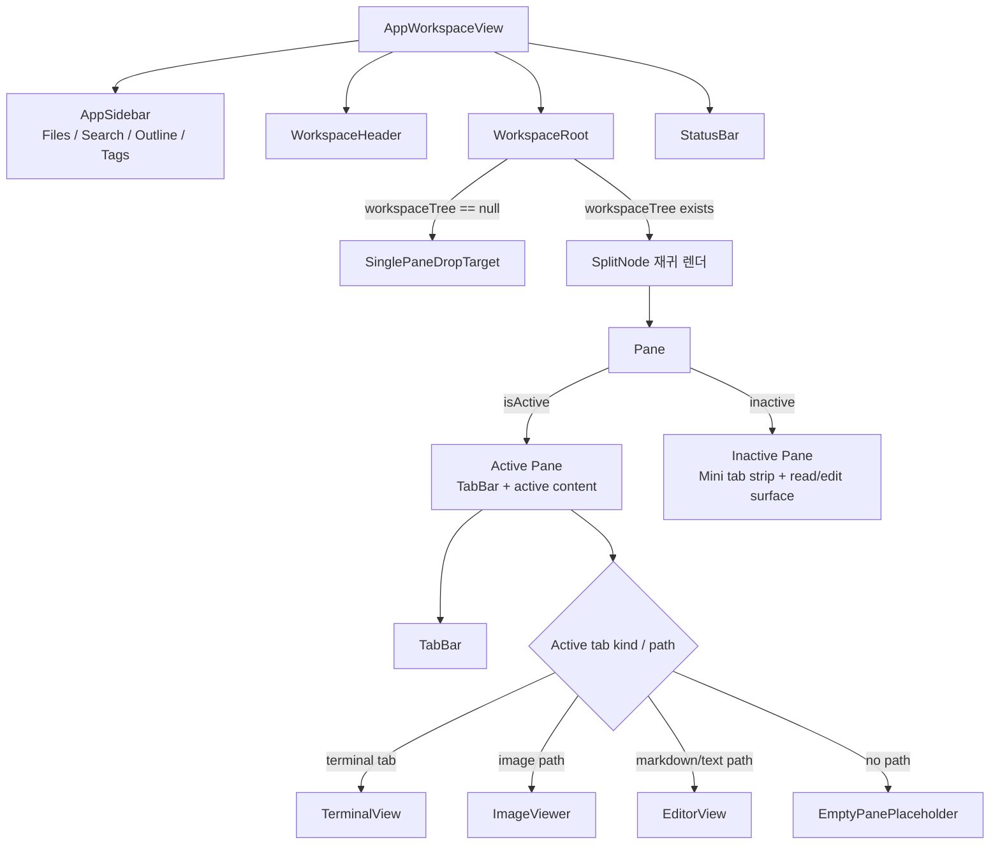

터미널은 독립 패널이 아니라 `Tab.kind = "terminal"`인 탭이다. 그래서 일반 문서 탭과 동일하게 split, close, tab strip 흐름을 공유한다.

## 4. 파일 열기와 에디터 로딩

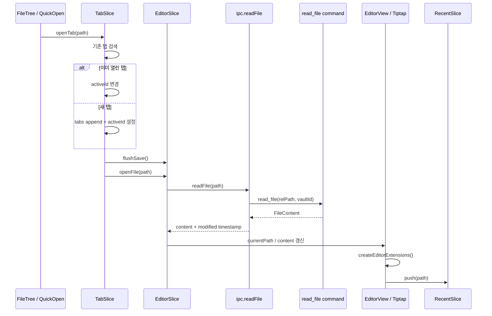

탭 전환은 먼저 현재 에디터의 pending save를 flush한 뒤 다음 파일을 연다. 터미널 탭으로 전환할 때는 `closeEditorFile()`로 에디터 상태를 비운다.

## 5. 자동 저장과 충돌 처리

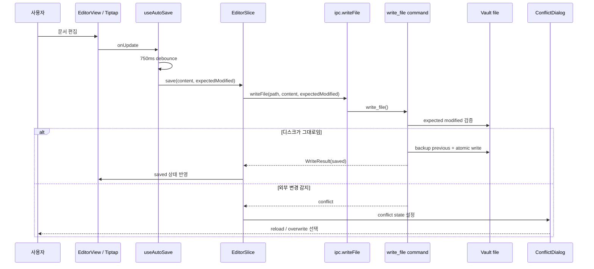

저장은 파일당 pending save를 제한하고, blur 시 즉시 flush한다. Rust 쪽은 쓰기 전 backup과 atomic write를 담당한다.

## 6. Markdown 에디터 확장 구조

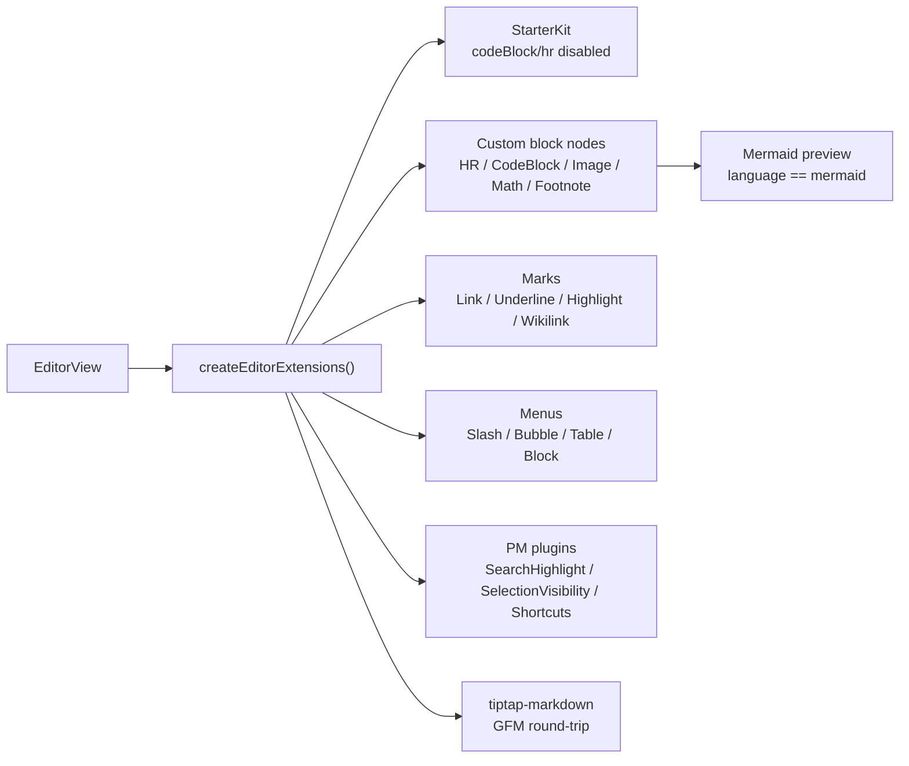

Mermaid는 별도 Markdown 문법이 아니라 기존 `codeBlock`의 `language`가 `mermaid`일 때 NodeView에서 preview를 붙이는 방식이다. 따라서 저장 포맷은 표준 fenced code block으로 유지된다.

## 7. Mermaid 블록 동작

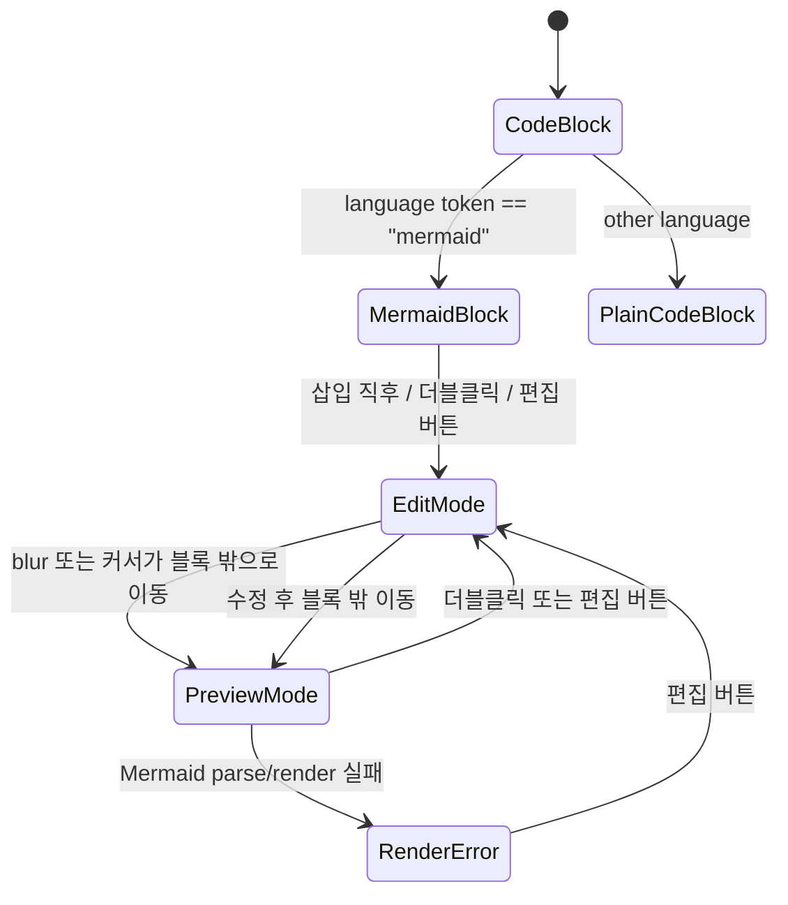

Slash command의 Mermaid 항목은 `setCodeBlock({ language: "mermaid" })`로 시작하고, 기본 예제를 삽입한다.

## 8. 터미널 탭 동작

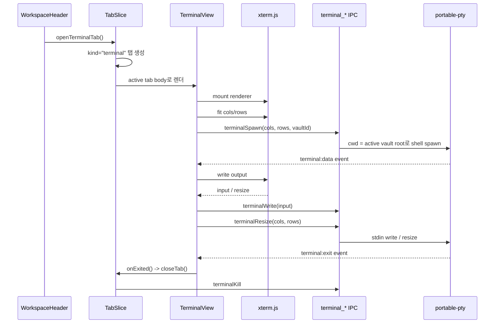

터미널은 Web UI 내부의 `@xterm/xterm` renderer와 Rust `portable-pty` session을 사용한다. 터미널 session은 workspace persistence에 저장하지 않는다.

## 9. 이미지 파일 열기

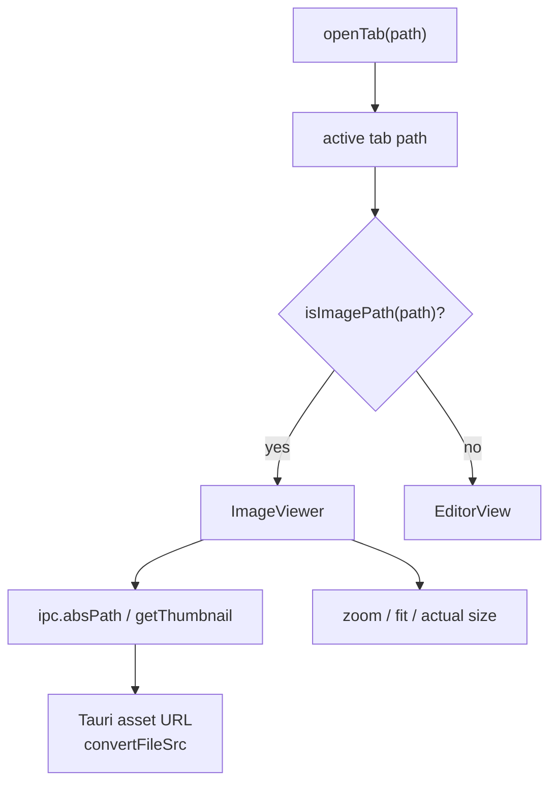

이미지 뷰어도 별도 앱 모드가 아니라 문서 탭의 body 분기다. 같은 탭/분할 레이아웃 정책을 그대로 사용한다.

## 10. 상태와 저장 위치

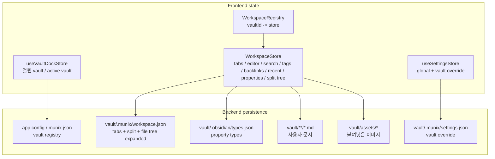

앱 전용 데이터는 `.munix/`와 일부 Obsidian 호환 파일에만 저장한다. 사용자 Markdown 원문은 표준 GFM을 유지한다.

## 11. 주요 사용자 액션별 라우팅

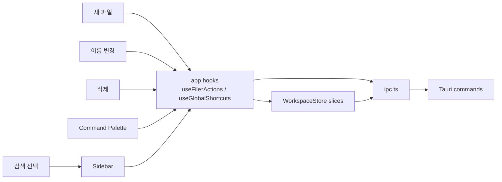

`App`은 화면과 전역 액션을 조립하는 orchestration layer다. 실제 파일 생성/삭제/이동/이름 변경은 `hooks/app/*`에 분리되어 있고, 최종 파일 작업은 IPC로 내려간다.

## 12. 한 줄 요약

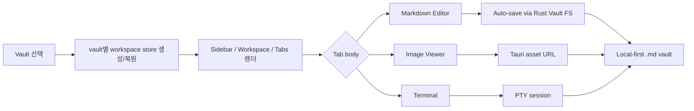

Munix는 “vault 단위 workspace 상태 + 표준 Markdown 파일 + Tauri IPC로 보호된 로컬 FS” 구조로 동작한다.
