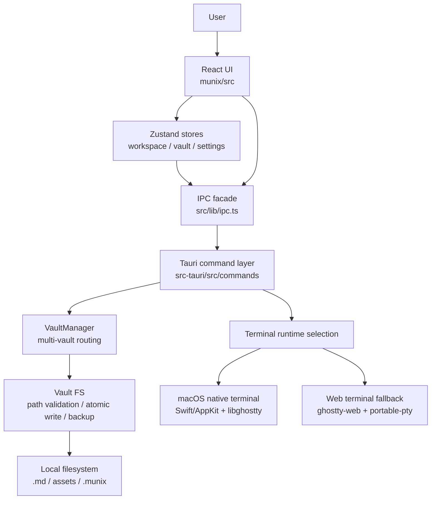
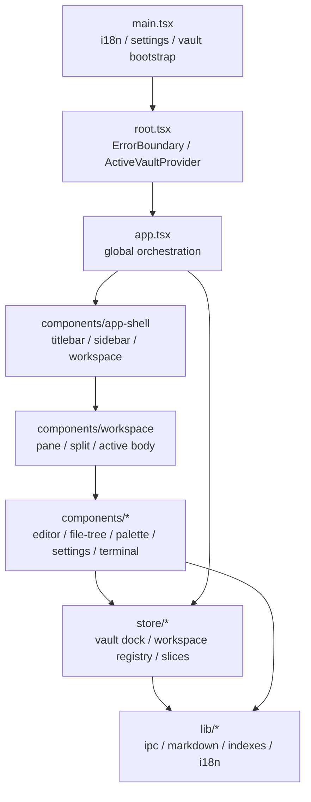
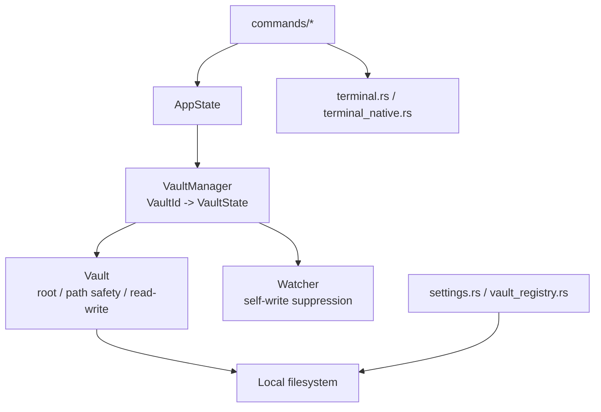
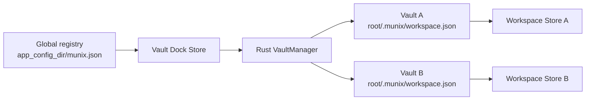
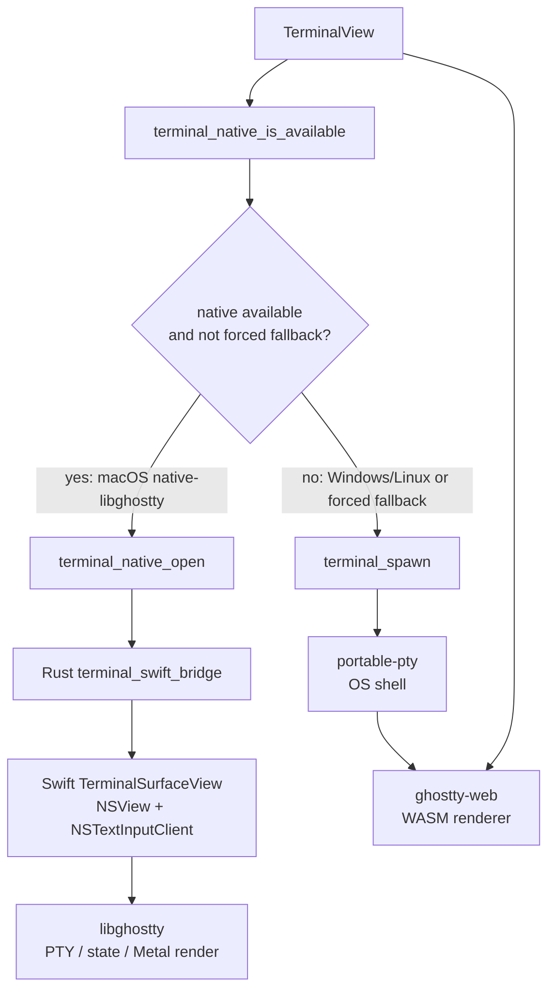
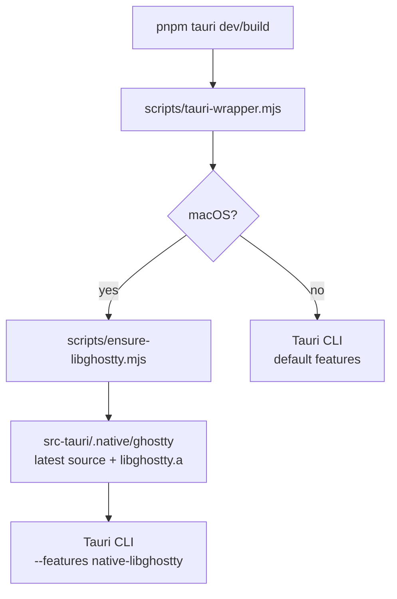

# Munix 앱 런타임 구조

> 구현 기준: `munix/src`, `munix/src-tauri/src`, `munix/src-tauri/native`
> 목적: Munix의 프론트, Rust 백엔드, native bridge, 플랫폼별 fallback 경계를 한 번에 파악하기 위한 문서.

## 1. 구조 요약

Munix는 Tauri 2 앱이다. UI와 workspace orchestration은 React가 맡고, 파일 시스템과 OS 자원 접근은 Rust command layer가 맡는다. 터미널은 플랫폼별 runtime을 선택한다.

핵심 경계:

- React는 로컬 파일 시스템에 직접 접근하지 않는다.
- vault 파일 작업은 항상 `ipc.ts` -> Tauri command -> Rust vault layer를 지난다.
- workspace 상태는 vault별 Zustand store에 둔다.
- terminal tab은 문서 탭과 같은 workspace/pane 시스템을 공유하되, runtime은 플랫폼별로 선택한다.

## 2. 프론트 계층

프론트의 책임:

- 앱 부팅 전에 `bootstrapVaultRegistry()`로 글로벌 vault registry를 복원한다.
- active vault는 `ActiveVaultProvider`와 `useVaultDockStore`가 제공한다.
- 파일, 검색, 탭, 최근 목록, workspace split 상태는 vault별 workspace store에 둔다.
- `lib/ipc.ts`는 Tauri command 이름을 프론트 코드에서 직접 흩뿌리지 않기 위한 typed facade다.

## 3. Rust 백엔드 계층

Rust의 책임:

- vault root 기준 상대 경로만 IPC로 받는다.
- path traversal과 vault 밖 접근을 차단한다.
- 저장은 원자적 쓰기와 백업 정책을 따른다.
- global registry는 OS별 `app_config_dir()` 아래 `munix.json`에 저장한다.
- workspace 상태는 vault별 `.munix/workspace.json`에 저장한다.
- terminal fallback에서는 `portable-pty` session을 관리한다.
- macOS native terminal에서는 Swift bridge attach/focus/resize/close만 호출한다.

## 4. Vault와 Workspace

운영 원칙:

- 여러 vault를 동시에 열 수 있다.
- active vault 전환은 left vault dock에서 일어난다.
- 각 vault는 독립 workspace tree, tab, recent/search 상태를 가진다.
- terminal session은 workspace persistence에 저장하지 않는다. 앱 재시작 시 shell session을 복원하지 않는다.

## 5. Terminal Runtime

현재 정책:

- macOS: `native-libghostty` feature가 포함되고 native host view가 준비되면 Swift/AppKit + `libghostty` embedded runtime을 사용한다.
- Windows/Linux: `ghostty-web` + Rust `portable-pty` fallback을 기본 제품 경로로 사용한다.
- macOS에서도 `localStorage["munix:terminalLegacyWebviewFallback"] = "true"`이면 fallback을 강제한다.
- `native-libghostty` feature가 없는 빌드는 native terminal을 available로 보고하지 않는다.

macOS native terminal 경계:

- React: terminal tab metadata, native bounds sync, close event 처리.
- Rust: vault cwd 검증, Tauri `NSView` handle 획득, Swift bridge FFI 호출.
- Swift/AppKit: `NSView` surface, focus, resize, key/mouse/scroll/IME/clipboard mapping.
- `libghostty`: PTY lifecycle, terminal state, scrollback, font shaping, Metal rendering.

fallback terminal 경계:

- React: `ghostty-web` mount, fit/resize, key input, screen state cache.
- Rust: `portable-pty` shell spawn, stdin/stdout/stderr, resize, kill.
- Tauri event: `terminal:data`, `terminal:exit`.

## 6. Platform Matrix

| Platform | Primary terminal runtime | Fallback | Notes |
|---|---|---|---|
| macOS | `libghostty` embedded through Swift/AppKit `NSView` | `ghostty-web + portable-pty` | build wrapper prepares latest Ghostty source and enables `native-libghostty` |
| Windows | `ghostty-web + portable-pty` | same | `libghostty` embedded C ABI does not expose `HWND` surface yet |
| Linux | `ghostty-web + portable-pty` | same | Ghostty GTK app exists, but current embedded C ABI does not expose GTK/X11/Wayland surface handles |

## 7. Build Flow

빌드 원칙:

- macOS 개발/운영 빌드는 wrapper가 Ghostty source와 static library를 준비한다.
- `GHOSTTY_INCLUDE_DIR`, `GHOSTTY_LIB_DIR`, `--features native-libghostty`는 wrapper가 주입한다.
- non-macOS는 기존 Tauri CLI 경로로 내려가고 terminal은 fallback runtime을 사용한다.

## 8. 관련 문서

- [client-frontend-architecture.md](./client-frontend-architecture.md): React 클라이언트 구조
- [app-architecture-mermaid.md](./app-architecture-mermaid.md): 주요 사용자 흐름 다이어그램
- [specs/terminal-spec.md](./specs/terminal-spec.md): 터미널 상세 설계
- [specs/multi-vault-spec.md](./specs/multi-vault-spec.md): 멀티 vault workspace 설계
- [specs/vault-spec.md](./specs/vault-spec.md): vault FS와 IPC 보안 설계
- [decisions.md](./decisions.md): ADR 기록
