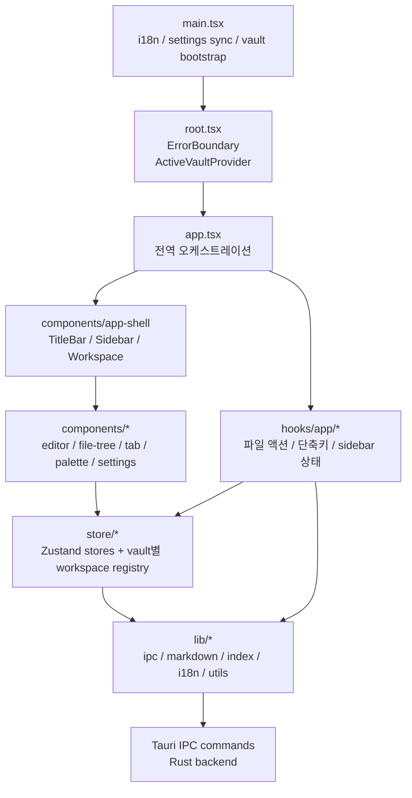
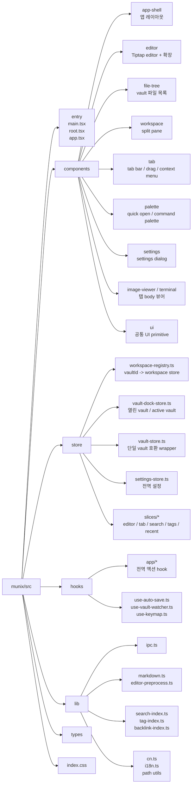
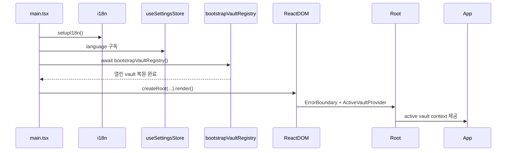
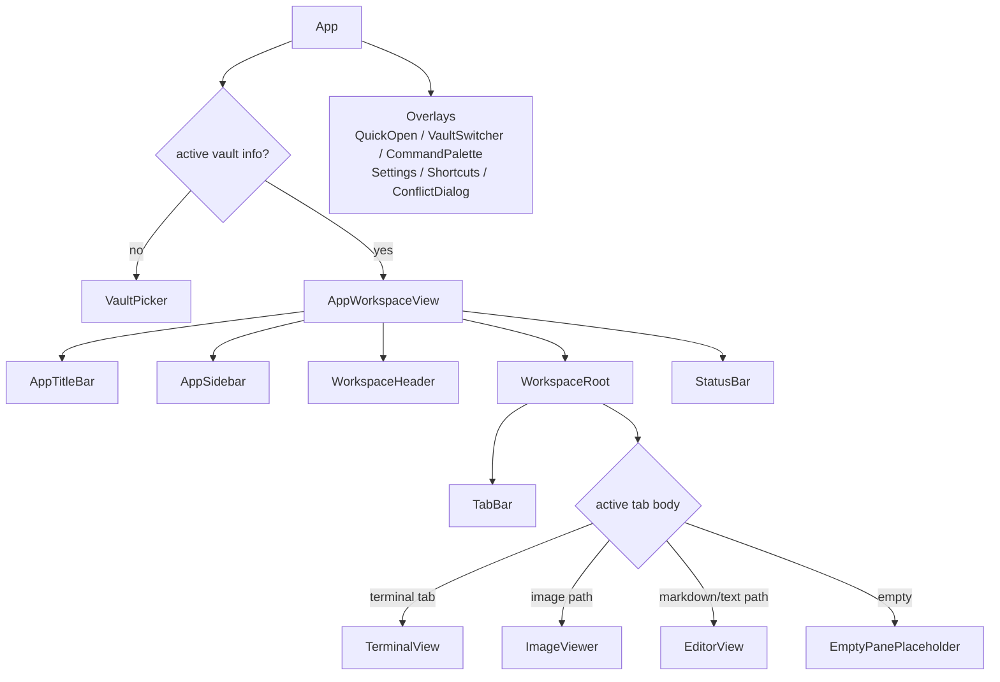
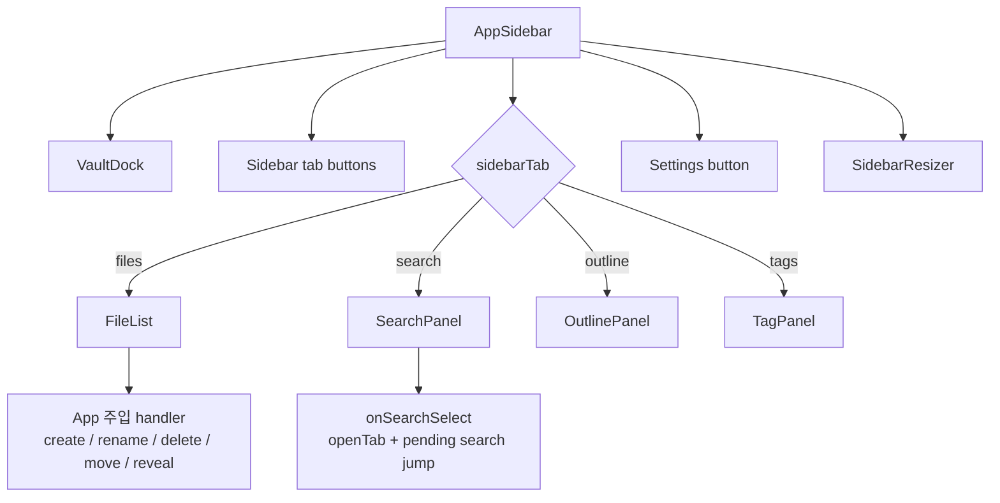
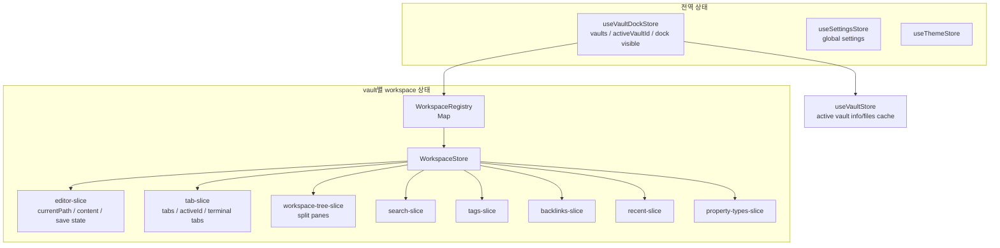
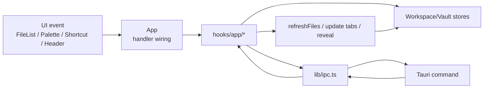
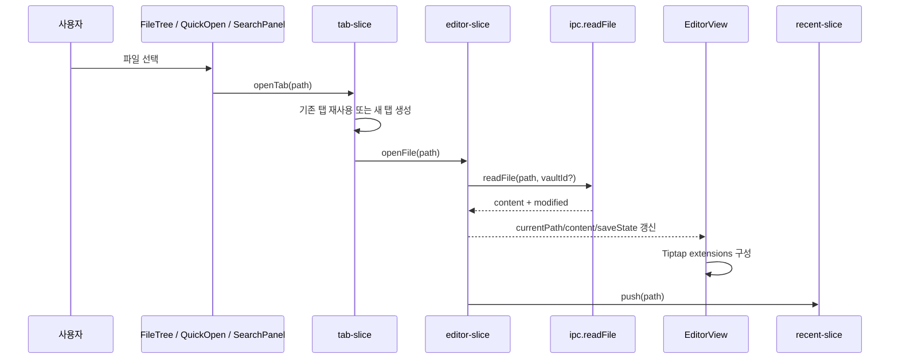
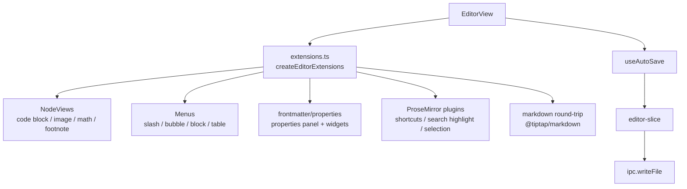
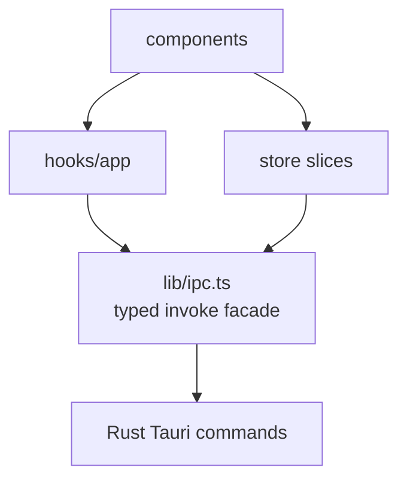

# Munix 클라이언트 프론트 구조

> 구현 기준: `munix/src`
> 목적: React 클라이언트의 책임 경계, 디렉터리 구조, 상태 흐름, 주요 UI 조립 방식을 빠르게 파악하기 위한 문서.

## 1. 구조 요약

Munix 프론트는 `main.tsx -> Root -> App -> AppWorkspaceView` 순서로 부팅되고, 화면은 `app-shell`, 기능은 `components/*`, 상태는 `store/*`, 백엔드 통신은 `lib/ipc.ts`를 중심으로 나뉜다.

핵심 원칙은 다음과 같다.

- `App`은 전역 상태와 액션을 연결하는 조립 계층이다.
- 화면 골격은 `components/app-shell`이 담당한다.
- 에디터, 파일 트리, 탭, 팔레트, 설정은 독립 기능 폴더로 분리한다.
- vault 파일 I/O는 프론트에서 직접 하지 않고 항상 `lib/ipc.ts`를 거친다.
- 문서/검색/탭/최근 목록 같은 작업 상태는 active vault 기준 workspace store에 둔다.

## 2. 디렉터리 맵

## 3. 부팅 흐름

`main.tsx`는 렌더 전에 앱 수준 초기화를 끝낸다. 특히 `bootstrapVaultRegistry()`를 먼저 실행해 `munix.json`의 열린 vault 상태를 복원한 뒤 React를 렌더한다.

## 4. 화면 조립 구조

`App`은 vault가 없으면 `VaultPicker`만 보여주고, active vault가 있으면 `AppWorkspaceView`를 렌더한다. 실제 작업 화면은 `AppWorkspaceView`에서 `AppTitleBar`, `AppSidebar`, `WorkspaceHeader`, `WorkspaceRoot`, `TabBar`, 탭 body, `StatusBar`로 조립된다.

## 5. Sidebar 구조

Sidebar는 vault dock과 네 개의 탭으로 구성된다. 파일 관련 액션은 sidebar 내부에서 직접 IPC를 호출하지 않고, `App`에서 주입한 handler를 호출한다.

## 6. 상태 구조

전역 vault 목록은 `useVaultDockStore`가 관리하고, active vault의 작업 상태는 `WorkspaceRegistry`가 `vaultId`별 Zustand store로 관리한다. `useVaultStore`는 단일 vault 시절 API 호환을 위한 캐시 wrapper다.

영구화 위치는 다음처럼 나뉜다.

- `munix.json`: 글로벌 vault registry
- `vault/.munix/workspace.json`: 탭, active tab, split tree, 파일 트리 펼침 상태
- `vault/.munix/settings.json`: vault별 설정 override
- `vault/.obsidian/types.json`: Obsidian 호환 property type
- `vault/**/*.md`: 사용자 Markdown 문서

## 7. 주요 액션 흐름

파일 생성, 삭제, 이동, 이름 변경 같은 액션은 `App`에서 `hooks/app/*`로 분리되어 있다. UI 컴포넌트는 handler만 호출하고, hook이 store와 IPC를 조율한다.

## 8. 파일 열기 흐름

문서를 여는 진입점은 여러 개지만 결국 `openTab(path)`로 모인다. active tab이 바뀌면 editor slice가 파일을 읽고 `EditorView`가 Tiptap 인스턴스로 렌더한다.

## 9. Editor 하위 구조

`components/editor`는 Tiptap 기반 편집기와 Markdown 호환 확장을 모은다. `extensions.ts`가 확장 조립 지점이고, 저장은 `useAutoSave`와 editor slice를 통해 IPC로 내려간다.

## 10. IPC 경계

프론트의 백엔드 호출은 `lib/ipc.ts`에 모아져 있다. 컴포넌트가 직접 `invoke()`를 흩뿌리지 않고, `ipc.*` 메서드 또는 그 위의 hook/store 액션을 사용한다.

대표 IPC 그룹은 다음과 같다.

- Vault: `openVault`, `closeVault`, `listOpenVaults`, `setActiveVault`
- File: `listFiles`, `readFile`, `writeFile`, `createFile`, `renameEntry`, `deleteEntry`
- Workspace: `workspaceLoad`, `workspaceSave`
- Settings: `loadSettings`, `saveSettings`, `vaultSettingsLoad`, `vaultSettingsSave`
- Asset/Image: `saveAsset`, `absPath`, `getThumbnail`
- Terminal: `terminalSpawn`, `terminalWrite`, `terminalResize`, `terminalKill`

## 11. 작업 시 기준

- 새 화면 골격은 `components/app-shell` 또는 `components/workspace`에 둔다.
- 특정 기능 UI는 `components/{feature}` 아래에 둔다.
- 파일 액션처럼 여러 UI에서 공유되는 앱 액션은 `hooks/app`에 둔다.
- vault별 작업 상태는 가능한 한 workspace slice로 넣는다.
- 전역 설정이나 앱 전체 상태만 독립 store로 둔다.
- Rust 호출이 필요하면 `lib/ipc.ts`에 typed facade를 먼저 추가한다.
- 신규 UI 텍스트는 하드코딩하지 않고 `t()`를 사용한다.
