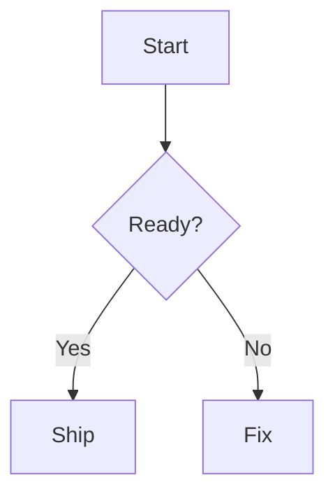
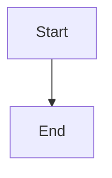

# Mermaid 다이어그램 상세 설계 — Munix

> Markdown fenced code block 기반 Mermaid 렌더링 지원.
> 파일 저장 형식은 표준 Markdown을 유지하며, Obsidian/GitHub 호환을 우선한다.

---

## 1. 목적

- 노트 안에서 flowchart, sequence diagram, state diagram, ERD 등 Mermaid 다이어그램을 바로 미리보기한다.
- `.md` 원문은 표준 fenced code block으로 유지해서 Obsidian/GitHub와 호환한다.
- 편집 경험은 코드 블록 기반으로 단순하게 유지하되, 읽을 때는 다이어그램으로 보이게 한다.

## 2. 요구사항

### 2.1 기능 요구사항

| ID | 요구사항 | 우선순위 |
|---|---|---|
| MMD-01 | ` ```mermaid ` 코드 블록을 Mermaid 다이어그램으로 렌더링 | P0 |
| MMD-02 | 저장 시 원본 Markdown fenced code block을 그대로 보존 | P0 |
| MMD-03 | 다이어그램 렌더 실패 시 원본 코드와 에러 메시지 표시 | P0 |
| MMD-04 | 편집 모드와 미리보기 모드를 전환할 수 있어야 함 | P0 |
| MMD-05 | Slash command에서 Mermaid diagram 블록 삽입 | P1 |
| MMD-06 | 앱 테마에 맞춰 Mermaid theme를 dark/base로 매핑 | P1 |
| MMD-07 | 렌더 결과 확대/축소 또는 fit-to-width 지원 | P1 |
| MMD-08 | SVG 복사 / PNG 내보내기 | P2 |
| MMD-09 | 다이어그램 내부 텍스트 검색 또는 outline 연동 | P2 |

### 2.2 비기능 요구사항

- Mermaid 라이브러리는 에디터 초기 번들에 즉시 포함하지 않고 lazy import한다.
- 다이어그램 렌더링 실패가 에디터 전체 렌더링을 깨면 안 된다.
- 동일 문서에 다이어그램이 여러 개 있어도 입력 지연을 만들지 않아야 한다.
- security level은 기본적으로 strict 계열을 사용한다.

## 3. Markdown 매핑

### 3.1 저장 형식

Mermaid는 별도 커스텀 Markdown 문법을 만들지 않고 fenced code block을 사용한다.

````md

````

### 3.2 파싱 규칙

- code block language가 `mermaid`인 경우 Mermaid block으로 취급한다.
- language 비교는 case-insensitive로 한다. 예: `Mermaid`, `MERMAID`.
- `mermaid ` 뒤 추가 meta string은 v1에서는 보존하되 렌더 옵션에는 사용하지 않는다.
- Markdown 저장 시 입력 원문 줄바꿈과 indentation을 최대한 보존한다.

### 3.3 Mermaid 구분값 판정 케이스

에디터는 fenced code block의 info string 첫 번째 token을 기준으로 Mermaid 여부를 판단한다.

````md
```{info string}
...
```
````

판정 단계:

1. opening fence 뒤 문자열을 trim한다.
2. 첫 번째 공백 전까지를 language token으로 본다.
3. language token을 lower-case로 비교한다.
4. language token이 지원 목록에 있으면 Mermaid block으로 렌더한다.
5. 나머지 meta string은 보존하되 v1 렌더 옵션에는 반영하지 않는다.

#### 지원 구분값

| 입력 info string | language token | Mermaid 판정 | 저장 정책 | 비고 |
|---|---:|---:|---|---|
| `mermaid` | `mermaid` | ✅ | 원문 유지 | canonical |
| `Mermaid` | `mermaid` | ✅ | 원문 유지 | 대소문자 허용 |
| `MERMAID` | `mermaid` | ✅ | 원문 유지 | 대소문자 허용 |
| `mermaid title="Flow"` | `mermaid` | ✅ | meta 포함 원문 유지 | meta는 v1에서 렌더 옵션 미반영 |
| `mermaid preview` | `mermaid` | ✅ | meta 포함 원문 유지 | 향후 옵션 후보 |
| `mermaid:flowchart` | `mermaid:flowchart` | ❌ | code block 유지 | v1 비지원 |
| `mmd` | `mmd` | ❌ | code block 유지 | alias는 v1 비지원 |
| `diagram` | `diagram` | ❌ | code block 유지 | alias는 v1 비지원 |
| `flowchart` | `flowchart` | ❌ | code block 유지 | Mermaid syntax 이름이지만 language는 아님 |
| 빈 info string | 없음 | ❌ | code block 유지 | plain code |

v1 canonical 구분값은 **`mermaid` 하나만** 둔다. `mmd`, `diagram`, `flowchart` 같은 alias는 자동 인식하지 않는다. 이유는 다른 코드 블록 언어/사용자 관습과 충돌 가능성이 있고, Obsidian/GitHub 호환의 사실상 표준이 `mermaid`이기 때문이다.

#### Fence 종류

| Fence | 예시 | Mermaid 판정 | 비고 |
|---|---|---:|---|
| Backtick fence | ```` ```mermaid ```` | ✅ | 기본 |
| Tilde fence | `~~~mermaid` | ✅ | Markdown parser가 info string을 제공하면 지원 |
| Indented code block | `    flowchart TD` | ❌ | info string이 없으므로 plain code |
| Inline code | `` `mermaid ...` `` | ❌ | block only |

#### Round-trip 정책

- 입력 info string의 대소문자와 meta string은 저장 시 보존한다.
- 내부 UI label은 항상 `Mermaid`로 표시한다.
- 새로 삽입하는 Mermaid block은 canonical ` ```mermaid `를 사용한다.
- 사용자가 `Mermaid`로 작성한 block을 저장한다고 `mermaid`로 강제 소문자화하지 않는다.
- syntax error가 있어도 language token이 `mermaid`이면 Mermaid block으로 유지하고 error UI를 표시한다.

## 4. Editor 모델

### 4.1 Tiptap NodeView 정책

기본 노드는 기존 `codeBlock`을 유지한다. `language === "mermaid"`일 때만 전용 NodeView를 붙인다.

```ts
interface MermaidBlockAttrs {
  language: "mermaid";
  code: string;
  meta?: string;
}
```

전용 schema node를 새로 만들지 않는 이유:

- Markdown round-trip이 단순하다.
- 기존 code block 편집/저장 로직을 재사용할 수 있다.
- Obsidian/GitHub 호환 fenced block을 그대로 유지한다.

### 4.2 렌더 상태

```ts
type MermaidRenderState =
  | { kind: "idle" }
  | { kind: "rendering" }
  | { kind: "rendered"; svg: string }
  | { kind: "error"; message: string };
```

렌더링은 block 단위로 debounce한다.

- 입력 중: 300ms debounce 후 render
- blur: 즉시 render
- 문서 로드: viewport에 들어온 Mermaid block부터 render

## 5. UI/UX 플로우

### 5.1 기본 표시

- Mermaid block은 기본적으로 preview 모드로 표시한다.
- preview 상단 우측에 작은 toolbar를 둔다.
- toolbar 항목:
  - 편집
  - 새로고침
  - 코드 복사
  - SVG 복사(P2)

### 5.2 편집 모드

- Obsidian Live Preview처럼 코드 블록 내부에 커서가 있으면 edit 모드로 유지한다.
- 편집 클릭, block 더블 클릭, 또는 preview 클릭 시 code editor 형태로 전환한다.
- 커서가 Mermaid block 밖으로 벗어나거나 blur되면 preview 모드로 돌아간다.
- 편집 모드에서는 기존 code block과 동일한 monospace UI를 사용한다.
- 편집 중 렌더 실패가 발생해도 코드 편집은 계속 가능해야 한다.
- ` ``` ` 자동 입력으로 생성된 코드 블록의 language token을 사용자가 `mermaid`로 바꾸면 Mermaid preview 대상이 된다.
- Slash command로 삽입한 Mermaid block은 처음부터 ` ```mermaid ` fenced block으로 만들되, 삽입 직후에는 edit 모드로 둔다.

### 5.3 에러 표시

렌더 실패 시:

- preview 영역에 에러 메시지를 compact하게 표시한다.
- 원본 코드는 접힌 형태로 함께 제공한다.
- 사용자가 “편집”을 누르면 즉시 code block 편집 상태로 들어간다.

### 5.4 Slash command

슬래시 메뉴 항목:

```ts
{
  id: "mermaid",
  title: "Mermaid",
  description: "다이어그램",
  keywords: ["mermaid", "diagram", "flowchart", "sequence", "graph"],
  group: "advanced",
}
```

삽입 기본값:

````md

````

## 6. 렌더링 정책

### 6.1 Mermaid 초기화

```ts
const mermaid = await import("mermaid");

mermaid.default.initialize({
  startOnLoad: false,
  securityLevel: "strict",
  theme: isDark ? "dark" : "base",
});
```

정책:

- `startOnLoad`는 사용하지 않는다. React NodeView가 직접 render를 호출한다.
- 각 block은 stable id를 사용해 render한다.
- theme 변경 시 visible Mermaid block만 재렌더한다.
- 렌더 결과 SVG는 DOMPurify 또는 Mermaid security policy로 안전하게 삽입한다.

### 6.2 보안

- Mermaid 입력은 vault 안의 Markdown에서 오므로 신뢰하지 않는다.
- HTML label, script, event handler 삽입은 허용하지 않는다.
- `securityLevel: "strict"`를 기본값으로 한다.
- 향후 사용자 설정에서 loosened mode를 제공하더라도 vault trust가 필요하다.

### 6.3 성능

- Mermaid 라이브러리는 첫 Mermaid block이 보일 때 lazy import한다.
- block이 viewport 밖이면 render를 지연할 수 있다.
- 렌더 중 같은 block code가 바뀌면 이전 render 결과는 폐기한다.
- 긴 문서에서 Mermaid block이 많으면 IntersectionObserver로 가시 block만 렌더한다.

## 7. 테마

### 7.1 기본 매핑

| Munix theme | Mermaid theme |
|---|---|
| dark | `dark` |
| light | `base` |
| system | resolved theme에 따라 `dark` 또는 `base` |

### 7.2 색상 토큰

P1에서 Mermaid themeVariables를 Munix 토큰과 맞춘다.

```ts
themeVariables: {
  background: "var(--color-bg-primary)",
  primaryColor: "var(--color-bg-secondary)",
  primaryTextColor: "var(--color-text-primary)",
  lineColor: "var(--color-border-strong)",
  fontFamily: "var(--font-sans)",
}
```

## 8. 에러 처리

| 케이스 | 처리 |
|---|---|
| Mermaid lazy import 실패 | code block fallback + error state |
| Mermaid syntax error | error panel + edit action |
| 렌더 중 block 삭제 | 결과 폐기 |
| theme 변경 중 렌더 중복 | 마지막 요청만 반영 |
| SVG 삽입 sanitization 실패 | code block fallback |

## 9. 엣지 케이스

- code fence 안에 triple backtick이 포함된 경우 Markdown parser가 block을 잘라낼 수 있다. 사용자는 `~~~~` fence를 써야 한다.
- Mermaid syntax 중 `%%` 주석은 그대로 보존한다.
- 매우 큰 graph는 렌더링이 오래 걸릴 수 있으므로 timeout 또는 취소 정책이 필요하다.
- wikilink `[[Page]]`와 Mermaid syntax가 충돌할 수 있으므로 Mermaid block 내부에서는 wikilink input rule을 적용하지 않는다.
- 인쇄/내보내기에서 SVG 크기가 잘리지 않아야 한다.

## 10. 테스트 케이스

### 10.1 Markdown round-trip

- ` ```mermaid ` block 로드 → 저장 → 원문 유지
- language 대소문자 보존 또는 정상화 정책 확인
- Mermaid block 내부 indentation 보존

### 10.2 렌더링

- flowchart 렌더
- sequenceDiagram 렌더
- stateDiagram 렌더
- classDiagram 렌더
- ERD 렌더
- syntax error 표시

### 10.3 UI

- Slash command로 Mermaid block 삽입
- preview ↔ edit 전환
- theme 변경 시 재렌더
- 긴 문서에서 Mermaid block 스크롤 진입 시 렌더

### 10.4 보안

- HTML/script/event handler injection 시도 차단
- link click 정책 확인
- 외부 리소스 로드 차단

## 11. 오픈 이슈

- [ ] Mermaid 렌더 결과를 SVG string으로 직접 삽입할지, DOMPurify를 필수 의존성으로 둘지 결정
- [ ] code block node를 유지할지, 전용 `mermaidBlock` node로 분리할지 최종 결정
- [ ] preview 기본 / edit 기본 사용자 설정 필요 여부
- [ ] 이미지 export(PNG/SVG)를 v1 범위에 포함할지 결정
- [ ] Mermaid dark theme가 Munix 색상과 충분히 맞는지 시각 검증

---

**문서 버전:** v0.1
**작성일:** 2026-04-29
**상태:** Proposed — 구현 전 스펙
