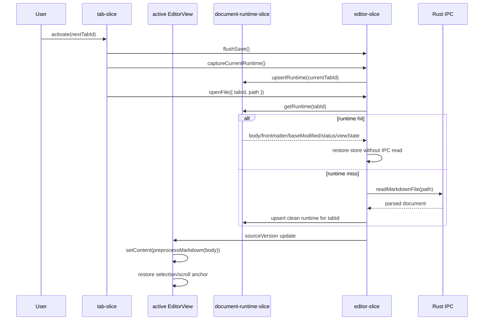

# Tab Runtime Cache 상세 설계 — Munix

> 탭 전환 시 불필요한 파일 재읽기와 Tiptap 문서 재수화를 줄이기 위한 런타임 캐시 설계.
> 전체 탭을 mounted 상태로 유지하지 않고, 문서 snapshot과 view state를 탭 단위로 보존한다.

---

## 1. 목적

Munix는 Obsidian 호환 Markdown 파일을 Tiptap 기반 편집 표면으로 보여준다. 현재 탭 전환 흐름은 active tab이 바뀔 때마다 파일을 다시 열고, Markdown body를 다시 preprocess한 뒤 Tiptap `setContent`로 문서를 다시 적용한다.

이 방식은 구현은 단순하지만 다음 문제가 있다.

- 같은 탭으로 돌아올 때도 디스크 read와 Markdown parse 비용이 반복된다.
- 커서 selection과 scroll position이 안정적으로 보존되지 않는다.
- Tiptap undo history는 탭 전환 시 사실상 유지되지 않는다.
- split pane에서 active/inactive editor가 나뉘어 있어 전역 단일 상태만으로는 탭별 상태를 표현하기 어렵다.

이 문서의 목표는 **전체 탭 keep-alive 없이**, 탭 전환 체감 비용을 줄이는 안전한 단계별 구현 계획을 정의하는 것이다.

현재 구현 상태:

- 2026-05-02 기준 1차 구현 완료. 단, hidden tab Mermaid background prewarm은 후속 항목이다.
- active editor와 split 화면 inactive pane editor가 같은 tabId runtime cache를 사용한다.
- Mermaid visual loading UI를 제거하고, SVG render 결과의 `height/viewBox` cache와 deterministic fallback reservation을 사용한다.
- `ResizeObserver` 기반 scroll anchor 재보정은 active editor에 적용했다.
- live editor LRU cache와 undo history 보존은 아직 후속 검토 항목이다.

---

## 2. 결론

Munix의 권장 정책은 다음과 같다.

1. **모든 탭을 렌더링 유지하지 않는다.**
   - 탭 최대 10개라도 모든 Tiptap `Editor`/ProseMirror `EditorView`/React NodeView를 유지하면 확장, Mermaid, 이미지, 테이블, 검색 highlight가 늘어날수록 메모리와 이벤트 리스너 비용이 커진다.

2. **화면에 보이는 editor만 mounted 상태로 둔다.**
   - active pane의 active tab editor.
   - split 화면에서 보이는 inactive pane의 active tab editor.
   - 같은 pane 안의 비활성 탭은 mounted editor가 아니라 snapshot으로 보존한다.

3. **1차는 document runtime snapshot cache를 구현한다.**
   - 탭별 body/frontmatter/baseModified/status/selection/scroll anchor를 보존한다.
   - 탭 재전환 시 cache hit이면 디스크 read를 건너뛰고 store를 복원한다.

4. **2차에서만 live editor LRU cache를 검토한다.**
   - undo history 보존이 제품 요구가 되었거나, snapshot cache 이후에도 재수화 비용이 큰 경우에만 도입한다.
   - 초기값은 `MAX_LIVE_EDITORS = 2` 정도로 제한한다.

5. **Mermaid 렌더 크기는 사전 정확 예측 대상이 아니다.**
   - 최초 diagram은 Mermaid render 전 최종 SVG bounds를 정확히 알 수 없다고 본다.
   - 일반적인 해결 패턴처럼 "이전 실제 측정값 재사용 + deterministic fallback + render 후 보정"으로 처리한다.
   - 모든 Mermaid block을 고정 높이로 강제하는 정책은 기본값으로 채택하지 않는다.

---

## 3. 참고한 선례

### 3.1 VS Code / Monaco

VS Code 계열 편집기는 document model과 editor view를 분리한다. Monaco도 파일별 `ITextModel`과 editor의 view state를 분리하고, editor는 `setModel`, `saveViewState`, `restoreViewState`로 전환한다.

Munix에 그대로 적용할 수는 없지만, 가져올 원칙은 명확하다.

- 파일/탭의 문서 상태와 화면 editor instance를 분리한다.
- 탭 전환 시 editor instance를 무조건 늘리지 않는다.
- selection/scroll 같은 view state는 문서 내용과 별도로 저장한다.

### 3.2 Obsidian

Obsidian은 tab group/pane 모델을 제공한다. Munix도 `workspace-split-spec.md`에서 pane별 탭과 inactive pane editable surface를 채택했다.

Munix에 필요한 원칙:

- pane별 active tab은 화면에 보이는 편집 표면을 가질 수 있다.
- 같은 pane 안의 비활성 탭까지 모두 편집 surface로 유지할 필요는 없다.
- 같은 파일이 여러 pane/tab에서 열릴 수 있으므로 UI runtime state는 path 기준만으로 관리하면 안 된다.

### 3.3 Tiptap / ProseMirror

Tiptap의 비용 중심은 React 컴포넌트 렌더링만이 아니다. `Editor`는 ProseMirror `EditorView`, plugin view, node view, extension state를 포함한다. `destroy()`는 DOM과 node view를 정리하고, destroy된 view는 재사용하면 안 된다.

Munix에 필요한 원칙:

- mounted editor 개수를 제한한다.
- Tiptap `Editor` 생명주기와 Markdown document state를 분리한다.
- React state 변경으로 editor 주변 panel이 과도하게 remount되지 않게 기존 ADR-030 원칙을 유지한다.

---

## 4. 현재 구조 분석

### 4.1 Active editor

현재 active tab은 `tab-slice.ts`의 `openFileInEditor(path)` 흐름을 통해 `editor-slice.ts`의 `openFile(relPath)`를 호출한다.

```ts
async function openFileInEditor(path: string): Promise<void> {
  if (!path) {
    await closeEditorFile();
    return;
  }
  const editor = useEditorStore.getState();
  await editor.flushSave?.();
  await useEditorStore.getState().openFile(path);
  useRecentStore.getState().push(path);
}
```

`editor-slice.ts`는 매번 `ipc.readMarkdownFile(relPath)`를 호출하고 `body/sourceVersion/baseModified`를 갱신한다. `EditorView`는 `sourceVersion`이 바뀌면 Tiptap `setContent(preprocessMarkdown(body))`를 실행한다.

### 4.2 Inactive pane editor

split workspace에서는 inactive pane도 editable surface를 가진다. `InactivePaneBody`는 pane의 active tab만 `InactivePaneEditor`로 렌더한다. 이때 같은 pane 안의 다른 탭들은 렌더되지 않는다.

`useInactivePaneDocumentLoader(path)`는 path 변경 시 `ipc.readFile(path)`로 다시 읽고, 로컬 state에 `body/frontmatter/baseModified/status`를 둔다.

### 4.3 문제의 핵심

현재 구조에서 탭 전환 비용은 세 가지로 나뉜다.

| 비용                      | 현재 원인                                        | 1차 해결                                                                               |
| ------------------------- | ------------------------------------------------ | -------------------------------------------------------------------------------------- |
| 디스크 read               | active/inactive loader가 path 기준으로 매번 read | tab runtime cache hit이면 read 생략                                                    |
| Markdown preprocess/parse | body 복원 시 매번 preprocess + setContent        | cache hit이어도 최초 mount editor에는 setContent 필요. 단 read/parseDocument 비용 제거 |
| selection/scroll 손실     | 탭별 view state 저장 없음                        | tabId 기준 selection/scroll anchor 저장                                                |

---

## 5. 요구사항

### 5.1 기능 요구사항

| ID     | 요구사항                                                                                                   | 우선순위 |
| ------ | ---------------------------------------------------------------------------------------------------------- | -------- |
| TRC-01 | 탭 전환 전 현재 editor의 body/frontmatter/baseModified/status를 tabId 기준으로 저장                        | P0       |
| TRC-02 | 탭 전환 시 tab runtime cache가 있으면 디스크 read 없이 editor-store 복원                                   | P0       |
| TRC-03 | selection과 scroll anchor를 탭별로 저장/복원                                                               | P0       |
| TRC-04 | split inactive pane editor도 같은 runtime cache를 사용                                                     | P0       |
| TRC-05 | 같은 파일을 여러 탭/pane에서 열어도 selection/dirty/status가 섞이지 않음                                   | P0       |
| TRC-06 | 외부 파일 수정 watcher가 clean runtime은 invalidate하고 dirty runtime은 덮어쓰지 않음                      | P0       |
| TRC-07 | 파일 rename/delete/close 시 runtime cache도 갱신/정리                                                      | P0       |
| TRC-08 | runtime cache 크기를 제한하고 오래된 항목을 prune                                                          | P1       |
| TRC-09 | tab 전환 성능 측정 로그를 dev mode에서 확인 가능                                                           | P2       |
| TRC-10 | Mermaid 등 비동기 렌더링 블록 때문에 layout height가 늦게 바뀌어도 scroll 복원은 best-effort로 보정        | P1       |
| TRC-11 | Mermaid 최초 렌더 전 정확 height 예측을 구현 목표로 잡지 않고, cache/fallback/render 후 보정 정책을 따른다 | P1       |

### 5.2 비기능 요구사항

- 모든 탭의 Tiptap editor를 mounted 상태로 유지하지 않는다.
- runtime cache는 vault workspace store에 속한다.
- UI 편집 상태는 `tabId` 기준으로 저장한다.
- clean disk snapshot은 선택적으로 `path` 기준으로 저장할 수 있다.
- path traversal, vault scope, watcher suppress 정책은 기존 vault/autosave 설계를 따른다.

---

## 6. 비범위

1차 구현에서는 다음을 제외한다.

- Tiptap undo/redo history 보존.
- Tiptap `Editor` instance LRU keep-alive.
- 같은 파일을 두 탭에서 동시에 dirty 상태로 편집할 때 자동 병합.
- pane별 독립 find-in-file/search highlight 영구 보존.
- runtime cache의 IndexedDB 영구화.
- hidden tab Mermaid background prewarm.

---

## 7. 데이터 모델

### 7.1 Tab runtime state

UI 편집 상태는 반드시 `tabId` 기준으로 저장한다. 같은 path가 여러 tab/pane에서 열릴 수 있기 때문이다.

```ts
interface DocumentRuntime {
  tabId: string;
  path: string;
  body: string;
  frontmatter: Record<string, unknown> | null;
  baseModified: number | null;
  status: SaveStatus;
  selection?: {
    from: number;
    to: number;
  };
  scroll?: {
    top: number;
    anchorPos?: number;
    anchorOffsetTop?: number;
  };
  dirty: boolean;
  externalModified?: boolean;
  lastAccessedAt: number;
}
```

### 7.2 Clean path cache

선택 사항이다. path 기준 clean cache는 디스크 read 결과를 짧게 재사용하기 위한 용도다. dirty state, selection, scroll anchor는 절대 path cache에 저장하지 않는다.

```ts
interface CleanDocumentCache {
  path: string;
  body: string;
  frontmatter: Record<string, unknown> | null;
  modified: number;
  lastReadAt: number;
}
```

### 7.3 Workspace slice

```ts
interface DocumentRuntimeSlice {
  runtimes: Record<string, DocumentRuntime>;
  cleanDocuments: Record<string, CleanDocumentCache>;

  getRuntime: (tabId: string) => DocumentRuntime | null;
  getRuntimeForPath: (path: string) => DocumentRuntime[];
  upsertRuntime: (runtime: DocumentRuntime) => void;
  removeRuntime: (tabId: string) => void;
  removeRuntimesForPath: (path: string) => void;
  renameRuntimePath: (oldPath: string, newPath: string) => void;
  invalidatePath: (path: string, opts?: { externalModified?: boolean }) => void;
  pruneRuntimeCache: () => void;
}
```

### 7.4 Editor slice 변경

`EditorSlice`에는 현재 문서를 식별할 `currentTabId`와 capture 함수를 추가한다.

```ts
interface EditorSlice {
  currentTabId: string | null;
  currentPath: string | null;

  openFile: (input: { tabId: string; path: string }) => Promise<void>;
  closeFile: () => void;

  captureCurrentRuntime: (() => DocumentRuntime | null) | null;
  setCaptureCurrentRuntime: (fn: (() => DocumentRuntime | null) | null) => void;
}
```

---

## 8. Runtime key 정책

### 8.1 tabId 기준

다음 항목은 `tabId` 기준으로 저장한다.

- body
- frontmatter
- baseModified
- save status
- dirty 여부
- selection
- scroll anchor
- externalModified flag

### 8.2 path 기준

다음 항목은 `path` 기준으로 저장 가능하다.

- 마지막 clean read 결과
- disk modified timestamp
- path invalidation 상태

### 8.3 같은 파일을 여러 탭에서 열 때

같은 `path`를 가진 tab이 여러 개 있을 수 있다.

- clean state는 path cache에서 공유 가능.
- dirty state는 공유하지 않는다.
- selection/scroll anchor는 공유하지 않는다.
- 한 tab이 저장에 성공하면 같은 path의 clean runtime은 최신 body/baseModified로 갱신할 수 있다.
- 같은 path의 다른 dirty runtime은 자동 갱신하지 않는다. 충돌 감지에 맡긴다.

---

## 9. 동작 흐름

### 9.1 탭 전환



### 9.2 Editor capture

`EditorView`는 mounted editor에서 다음 값을 추출한다.

- `editor.storage.markdown.getMarkdown()`
- `useEditorStore.getState().frontmatter`
- `useEditorStore.getState().baseModified`
- `useEditorStore.getState().status`
- `editor.state.selection.from/to`
- fallback용 `scrollRef.current?.scrollTop`
- viewport 상단에 가장 가까운 block의 ProseMirror pos와 viewport top 대비 offset

capture는 다음 시점에 호출한다.

- active tab 전환 직전.
- active pane 전환 직전.
- tab close 직전.
- vault 전환 직전.
- app 종료 저장 대기 훅이 도입될 때.

### 9.3 Editor restore

`EditorView`는 `setContent` 후 다음 순서로 view state를 복원한다.

1. pending search/jump가 있으면 search/jump가 우선한다.
2. pending search/jump가 없고 runtime selection이 있으면 `setTextSelection`.
3. runtime scroll anchor가 있으면 anchor block을 기준으로 scroll을 복원한다.
4. runtime이 없으면 기존처럼 문서 시작으로 focus/scroll.

### 9.4 Mermaid / async layout 주의

scroll 복원은 selection 복원보다 어렵다. selection은 ProseMirror document position 기준이므로 문서 내용이 같으면 비교적 안정적이다. 반면 scroll은 DOM layout height에 의존한다.

특히 Mermaid block은 다음 이유로 scroll 복원이 흔들릴 수 있다.

- Mermaid module import와 render가 async로 실행된다.
- 렌더 전 placeholder 높이와 렌더 후 SVG 높이가 다를 수 있다.
- cache hit이면 빠르게 안정되지만 cache miss이면 탭 복원 직후 몇 프레임 뒤 문서 전체 높이가 바뀐다.
- target 위치 위쪽에 Mermaid block이 있으면 `scrollTop`을 즉시 적용해도 최종 화면 위치가 밀린다.

따라서 `scrollTop` 단일 값만 저장하는 방식은 채택하지 않는다. 1차 구현은 다음 hybrid 방식으로 간다.

```ts
interface ScrollRuntimeState {
  top: number;
  /**
   * viewport 상단에 가장 가까운 block position.
   * selection과 별개로 "사용자가 보고 있던 위치"를 복원하기 위한 anchor다.
   */
  anchorPos?: number;
  /**
   * anchor DOM top - scroll container viewport top.
   * 복원 시 anchor를 같은 상대 위치에 맞춘다.
   */
  anchorOffsetTop?: number;
}
```

복원 순서:

1. `setContent` 직후 selection을 먼저 복원한다.
2. `anchorPos`에 해당하는 DOM node를 찾는다.
3. anchor DOM의 현재 top을 계산해 `scrollTop += currentAnchorTop - desiredAnchorTop`으로 보정한다.
4. Mermaid 등 async block이 뒤늦게 높이를 바꾸는 경우를 위해 content surface에 `ResizeObserver`를 붙이고, 최대 2~3회 같은 anchor 보정을 재시도한다.
5. anchor DOM을 찾지 못하면 fallback으로 raw `top`을 적용한다.

주의:

- 이 복원은 **best-effort**다. Mermaid 렌더 실패, 다이어그램 소스 변경, 이미지 로드 지연처럼 최종 block height가 달라지는 경우 픽셀 단위 동일 복원은 보장하지 않는다.
- `setTimeout` 기반 지연 복원은 기본 전략으로 쓰지 않는다. `requestAnimationFrame`과 `ResizeObserver`를 우선 사용한다.
- Mermaid NodeView가 렌더 완료 이벤트를 제공하지 않으므로, 1차에서는 layout observer 기반으로 보정한다. 필요하면 Mermaid NodeView에서 `munix:layout-settled` 같은 내부 이벤트를 발행하는 P2 작업을 검토한다.

### 9.5 로딩 UI 제거 정책

탭 runtime cache 작업과 함께 editor 내부의 시각적 loading UI는 줄인다. 목적은 사용자가 문서 표면을 spinner/skeleton으로 가려진 상태로 보는 시간을 줄이고, layout 안정화는 내부적으로 처리하는 것이다.

제거 대상:

- 문서 hydrate 중 표시하는 `DocumentLoadingState`.
- Mermaid preview의 spinner/skeleton placeholder.
- "렌더링 중" 같은 Mermaid block 내부 loading label.

유지 또는 대체 대상:

- 파일 자체를 아직 읽지 못한 경우의 pane-level loading/error 상태.
- Mermaid render error UI.
- layout shift를 줄이기 위한 invisible/min-height reservation.

Mermaid는 visual loading UI 대신 다음 정책을 쓴다.

```ts
interface MermaidRenderResult {
  svg: string;
  error: string | null;
  height?: number;
  width?: number;
  viewBox?: string;
}
```

- render 성공 후 SVG root의 `viewBox`, `height`, 또는 actual DOM rect에서 height를 읽어 cache한다.
- cache hit이면 SVG와 cached height를 즉시 적용한다.
- cache miss이면 spinner를 보여주지 않고, 이전 runtime/cached height가 있으면 `min-height`만 조용히 적용한다.
- height 정보도 없으면 code block source의 대략적인 line count 기반 min-height만 적용한다.
- 최종 SVG가 들어온 뒤 `ResizeObserver` scroll anchor 보정이 실제 scroll 위치를 맞춘다.

### 9.6 Mermaid height 정확도 정책

Mermaid의 최종 높이를 **정확하게** 얻는 가장 안정적인 방법은 Mermaid를 실제로 render한 뒤, 반환된 SVG의 `height`/`viewBox`를 읽는 것이다. Mermaid 11.14.0 기준 공개 `RenderResult`는 `svg`, `diagramType`, `bindFunctions`만 제공한다. height/bounds 필드는 없다. 하지만 반환된 `svg` 문자열에는 diagram type에 따라 `width`, `height`, `viewBox`가 포함될 수 있으므로, render 완료 후 SVG 문자열을 parse해서 높이를 추출할 수 있다.

```ts
function readSvgMetrics(svg: string): {
  width?: number;
  height?: number;
  viewBox?: string;
} {
  const doc = new DOMParser().parseFromString(svg, "image/svg+xml");
  const root = doc.documentElement;
  const viewBox = root.getAttribute("viewBox") ?? undefined;
  const heightAttr = root.getAttribute("height");
  const widthAttr = root.getAttribute("width");
  const height = parseSvgLength(heightAttr) ?? parseViewBoxHeight(viewBox);
  const width = parseSvgLength(widthAttr) ?? parseViewBoxWidth(viewBox);
  return { width, height, viewBox };
}
```

정확도 단계:

| 단계 | 방식                                        |    정확도 |                비용 | 사용처                          |
| ---- | ------------------------------------------- | --------: | ------------------: | ------------------------------- |
| A    | render 완료 후 SVG `height`/`viewBox` parse |      높음 | Mermaid render 필요 | cache 저장, 다음 표시           |
| B    | 이전 render cache height 재사용             |      높음 |                낮음 | 탭 재전환, 동일 diagram         |
| C    | source line count 기반 min-height           |      낮음 |           매우 낮음 | 최초 render 전 임시 reservation |
| D    | Pretext로 source text 높이 계산             | 낮음~중간 |                낮음 | code block fallback 높이        |

중요한 한계:

- 최초로 보는 Mermaid diagram은 render 전에는 최종 SVG bounds를 알 수 없다.
- Mermaid 내부는 graph layout, text label measurement, edge routing, padding/theme를 적용한 뒤 SVG bounds를 만든다.
- 공개 API가 render 전 bounds 계산을 제공하지 않으므로, "render 없이 정확한 height"는 현재 제품 경로로 잡지 않는다.

따라서 Munix 정책:

1. Mermaid render 결과를 `{ svg, width, height, viewBox }`로 cache한다.
2. 동일 source/theme cache hit이면 NodeView mount 시 height를 즉시 적용한다.
3. cache miss이면 visual loader 없이 fallback min-height만 둔다.
4. render 완료 후 height cache를 갱신하고, scroll anchor를 재보정한다.
5. 탭 runtime cache가 생긴 뒤에는 hidden/inactive tab 문서의 Mermaid block background prewarm을 후속으로 검토할 수 있다.

### 9.7 예측 가능한 렌더 크기 정책

Mermaid block을 "예측 가능한 크기"로 렌더하는 것은 가능하지만, 기본 정책으로 **완전 고정 높이**를 강제하지 않는다.

완전 고정 높이 방식:

```text
Mermaid block outer height = fixed 360px
SVG = fit inside / inner scroll / zoom
```

장점:

- 문서 전체 height가 안정되어 raw scroll 복원이 쉬워진다.
- 최초 render 전에도 block reservation이 항상 동일하다.
- 구현이 단순하다.

단점:

- 작은 diagram은 과한 빈 여백이 생긴다.
- 큰 diagram은 지나치게 축소되거나 내부 scroll이 필요하다.
- 문서 scroll 안에 Mermaid 내부 scroll이 생겨 editor UX가 나빠진다.
- 실제 diagram 크기와 editor 표시 크기가 달라져 편집 피드백이 약해진다.
- export/copy/preview와 editor surface의 표시 정책이 갈라질 수 있다.

따라서 Munix의 기본 정책은 다음과 같다.

| 상황                                                    | 정책                                                                                     |
| ------------------------------------------------------- | ---------------------------------------------------------------------------------------- |
| render cache hit                                        | cached `height/viewBox/svg`를 즉시 사용한다.                                             |
| render cache miss + 같은 tab runtime에 이전 height 있음 | 이전 height를 initial reservation으로 사용한다.                                          |
| render cache miss + 이전 height 없음                    | source line count 기반 deterministic fallback height를 사용한다.                         |
| render 완료                                             | SVG `height/viewBox` 또는 actual DOM rect를 읽어 cache하고 scroll anchor를 재보정한다.   |
| 비정상적으로 큰 diagram                                 | P2에서 `max-height + zoom/fit` 옵션을 검토하되, 기본 내부 scroll 정책으로 만들지 않는다. |

fallback height는 정확 예측이 아니라 layout shift 완화를 위한 reservation이다.

```ts
function estimateMermaidFallbackHeight(source: string): number {
  const lines = source.split(/\r?\n/).length;
  return clamp(180 + lines * 10, 220, 640);
}
```

구현 시 실제 숫자는 현재 editor typography와 Mermaid block chrome을 확인한 뒤 조정한다. 중요한 것은 fallback이 deterministic해야 한다는 점이다. 같은 source와 같은 width 조건에서 매번 다른 높이를 만들면 scroll 복원 재현성이 떨어진다.

일반적인 제품 구현 패턴도 이 방향에 가깝다.

1. 이전 실제 측정값을 재사용한다.
2. 처음 보는 async block은 예측 가능한 fallback 공간을 둔다.
3. render 완료 후 실제 DOM/SVG 크기로 교정한다.
4. scroll은 raw pixel이 아니라 문서 anchor 기준으로 보정한다.
5. 큰 block만 별도 zoom/fit/max-height 정책을 둔다.

### 9.8 Mermaid prewarm

탭 전환 시 Mermaid height cache hit 비율을 높이기 위해, document runtime cache와 별개로 Mermaid render cache prewarm을 둘 수 있다. 1차 구현에는 포함하지 않고 후속 P2로 둔다.

흐름:

1. Markdown body에서 fenced code block 중 info string이 `mermaid`인 block을 추출한다.
2. `source + theme + font/config + containerWidth` key로 render cache를 조회한다.
3. miss인 block만 낮은 우선순위 queue에 넣는다.
4. queue는 Mermaid render를 직렬 실행한다.
5. render result에서 `svg/height/width/viewBox/error`를 저장한다.

주의:

- prewarm은 사용자 입력을 막지 않는다.
- active editor의 typing 중 Mermaid render queue가 너무 오래 돌면 취소 또는 뒤로 미룬다.
- 모든 Mermaid block을 문서 open 전에 blocking render하지 않는다. 그러면 로딩 UI를 제거해도 문서 표시 자체가 늦어진다.

---

## 10. Save/Dirty 정책

### 10.1 Dirty capture

`status.kind === "dirty" | "saving" | "error" | "conflict"`이면 runtime의 `dirty`는 true다.

```ts
function isDirtyStatus(status: SaveStatus): boolean {
  return (
    status.kind === "dirty" ||
    status.kind === "saving" ||
    status.kind === "error" ||
    status.kind === "conflict"
  );
}
```

### 10.2 저장 성공

저장 성공 시:

- 현재 tab runtime의 `body/baseModified/status/dirty` 갱신.
- 같은 path를 가진 clean runtime은 body/baseModified 갱신 가능.
- 같은 path를 가진 다른 dirty runtime은 자동 덮어쓰기 금지.
- search/tag/backlink 업데이트는 기존 `useAutoSave` 경로 유지.

### 10.3 Conflict

저장 conflict 시:

- runtime `status = { kind: "conflict" }`.
- `dirty = true`.
- `externalModified = true`.
- 탭 전환으로 conflict 상태가 사라지면 안 된다.

---

## 11. Watcher / 파일 조작 정책

### 11.1 외부 수정

`vault:fs-changed`에서 `kind === "modified"`이고 path가 cache에 있으면:

| runtime 상태                           | 처리                                                               |
| -------------------------------------- | ------------------------------------------------------------------ |
| clean                                  | runtime 제거 또는 `externalModified = true` 후 다음 open 때 reload |
| dirty                                  | body 덮어쓰기 금지, `externalModified = true` 표시                 |
| visible active editor + idle/saved     | 기존처럼 `reloadFromDisk()`                                        |
| visible active editor + dirty/conflict | reload 금지                                                        |

### 11.2 외부 삭제

파일 삭제 시:

- 기존 `removeByPath(path)`로 tab 제거.
- runtime slice의 `removeRuntimesForPath(path)` 호출.
- clean path cache 삭제.

### 11.3 Rename

rename 성공 시:

- 기존 tab path 갱신.
- search/tag/backlink path 갱신.
- runtime의 `path`도 `oldPath -> newPath`로 갱신.
- clean path cache key도 갱신.

### 11.4 Move

move는 rename과 같은 정책을 따른다. 폴더 이동으로 하위 path가 바뀌는 경우 `oldPath` prefix 기반으로 runtime path를 일괄 갱신한다.

---

## 12. Inactive pane 적용

`InactivePaneEditor`는 현재 path만 받는다. runtime cache 적용을 위해 tab id도 받아야 한다.

```ts
interface InactivePaneEditorProps {
  tabId: string;
  path: string;
  titleDraft?: string;
}
```

`InactivePaneBody`는 다음처럼 active tab id를 넘긴다.

```tsx
<InactivePaneEditor
  tabId={activeTab.id}
  path={activeTab.path}
  titleDraft={activeTab.titleDraft}
/>
```

`useInactivePaneDocumentLoader`도 `tabId`를 받아 runtime 우선 로드를 수행한다.

```ts
export function useInactivePaneDocumentLoader(tabId: string, path: string) {
  const runtime = workspace.getState().getRuntime(tabId);
  if (runtime && runtime.path === path && !runtime.externalModified) {
    // local state를 runtime에서 초기화
  }
  // miss면 기존처럼 ipc.readFile(path)
}
```

inactive pane editor도 unmount 전에 runtime capture를 해야 한다. 이 capture는 active editor의 `captureCurrentRuntime`과 별도 hook으로 구현한다.

---

## 13. Cache 크기 제한

초기 정책:

- `MAX_DOCUMENT_RUNTIMES = 30`
- `MAX_CLEAN_DOCUMENTS = 50`
- dirty/conflict runtime은 prune 대상에서 제외.
- 열린 tab의 runtime은 prune 대상에서 제외.
- prune은 탭 close, vault 전환, watcher 이벤트 후 opportunistic하게 실행.

정책 이유:

- 문서 탭 soft limit은 10개지만 split/multi-vault 전환 중 runtime이 잠시 누적될 수 있다.
- dirty runtime은 데이터 손실 방지를 위해 절대 자동 삭제하지 않는다.

---

## 14. Live editor LRU cache (2차)

1차 snapshot cache 이후에도 문제가 남을 때만 도입한다.

```ts
interface LiveEditorRuntime {
  tabId: string;
  editor: Editor;
  lastAccessedAt: number;
  mounted: boolean;
}
```

초기값:

- `MAX_LIVE_EDITORS = 2`
- visible editor는 live limit 계산에서 제외하거나 항상 우선 보존.
- evict 시 `capture -> editor.destroy()`.

주의:

- Tiptap `EditorContent`와 React NodeView가 editor instance 재마운트에 안전한지 별도 검증 필요.
- `editor.unmount()` 후 `editor.mount(element)` 흐름은 공식 API가 있지만, React wrapper와 DragHandle/BubbleMenu/TableMenu plugin view까지 안정적인지 수동 검증이 필요하다.
- 이 단계는 undo history 보존 목적이 명확할 때 진행한다.

---

## 15. 구현 단계

### Phase A — Runtime slice 추가

- [ ] `store/slices/document-runtime-slice.ts` 추가.
- [ ] workspace store composition에 slice 포함.
- [ ] runtime CRUD, path rename/delete/invalidate, prune 구현.
- [ ] 단위 테스트 추가.

### Phase B — Active editor 연동

- [ ] `EditorSlice.currentTabId` 추가.
- [ ] `openFile(path)`를 `openFile({ tabId, path })`로 변경.
- [ ] `tab-slice.ts`의 `openFileInEditor` / `syncEditorToActiveTab`에서 tabId 전달.
- [ ] `workspace-tree-slice.ts`의 `applyActivePaneSwap`에서 tabId 전달.
- [ ] `EditorView`에서 capture callback 등록.
- [ ] `EditorView`에서 restore selection/scroll anchor 구현.
- [ ] Mermaid 등 async block layout 변화에 대응하는 `ResizeObserver` 기반 scroll 보정 구현.

### Phase C — Inactive pane 연동

- [ ] `InactivePaneEditorProps`에 `tabId` 추가.
- [ ] `InactivePaneBody`에서 `activeTab.id` 전달.
- [ ] `useInactivePaneDocumentLoader(tabId, path)`로 변경.
- [ ] inactive pane unmount/path 변경 전 capture 구현.
- [ ] inactive autosave 성공 시 runtime 갱신.

### Phase D — Watcher / 파일 조작 정합성

- [ ] `useVaultWatcher`에서 modified/deleted 이벤트 시 runtime invalidate/remove.
- [ ] `updatePath`, `removeByPath`, `removeFromAllPanes`, rename/move action에서 runtime path 갱신.
- [ ] 저장 성공 시 clean path cache 갱신.
- [ ] conflict 상태가 탭 전환 뒤에도 유지되는지 확인.

### Phase E — 최적화 / 측정

- [ ] dev mode에서 탭 open cache hit/miss 로그 추가.
- [ ] `performance.mark`로 read/preprocess/setContent 구간 측정.
- [ ] runtime prune 정책 조정.
- [ ] snapshot cache 이후에도 느리면 live editor LRU ADR 작성.

---

## 16. 수정 예상 파일

| 파일                                                                 | 변경                                            |
| -------------------------------------------------------------------- | ----------------------------------------------- |
| `src/store/slices/document-runtime-slice.ts`                         | 신규 runtime cache slice                        |
| `src/store/workspace-types.ts` 또는 registry composition 파일        | slice 타입/생성자 연결                          |
| `src/store/slices/editor-slice.ts`                                   | `currentTabId`, runtime 우선 open, capture 등록 |
| `src/store/slices/tab-slice.ts`                                      | tabId 전달, 전환 전 capture                     |
| `src/store/slices/workspace-tree-slice.ts`                           | active pane swap 시 tabId 전달                  |
| `src/components/editor/editor-view.tsx`                              | capture/restore selection/scroll                |
| `src/components/workspace/pane/inactive-pane-body.tsx`               | `tabId` prop 전달                               |
| `src/components/workspace/pane/inactive-pane-editor.tsx`             | `tabId` prop, capture 연동                      |
| `src/components/workspace/pane/use-inactive-pane-document-loader.ts` | runtime 우선 로드                               |
| `src/components/workspace/pane/use-inactive-pane-autosave.ts`        | 저장 성공 시 runtime 갱신                       |
| `src/hooks/use-vault-watcher.ts`                                     | invalidate/remove                               |
| `src/hooks/app/use-file-rename-action.ts`                            | runtime rename                                  |
| `src/hooks/app/use-file-move-actions.ts`                             | runtime move/remove                             |
| `src/hooks/app/use-file-delete-actions.ts`                           | runtime remove                                  |

---

## 17. 테스트 계획

### 17.1 단위 테스트

- runtime upsert/get/remove.
- tabId가 다르면 같은 path여도 selection/scroll anchor/status가 분리됨.
- `renameRuntimePath`가 파일과 하위 path를 갱신.
- `removeRuntimesForPath`가 파일과 하위 path를 삭제.
- clean runtime은 invalidate되고 dirty runtime은 body가 보존됨.
- prune이 dirty/conflict/open tab runtime을 제거하지 않음.

### 17.2 통합 테스트

- 탭 A -> 탭 B -> 탭 A 전환 시 A의 body가 cache에서 복원됨.
- cache hit 시 `ipc.readMarkdownFile` 호출이 발생하지 않음.
- 탭 전환 후 cursor와 scroll anchor가 복원됨.
- Mermaid block 위/아래 위치에서 탭 전환 후 scroll anchor가 큰 폭으로 틀어지지 않음.
- 같은 파일을 두 pane에서 열고 각각 다른 scroll/selection을 유지.
- active pane swap 후 이전 pane active tab runtime이 보존됨.
- inactive pane active tab 전환 시 runtime이 보존됨.

### 17.3 수동 검증

- 큰 Markdown 파일에서 탭 재전환이 즉시 가까워지는지 확인.
- Mermaid/code/table/image가 있는 문서에서 cache restore 후 렌더가 깨지지 않는지 확인.
- 외부에서 파일 수정 후 clean hidden tab을 열면 최신 디스크 내용이 반영되는지 확인.
- 외부에서 파일 수정 후 dirty hidden tab을 열면 conflict/modified 안내가 사라지지 않는지 확인.
- 파일 rename 중 editor focus와 본문 cursor가 튀지 않는지 확인.

---

## 18. 위험과 대응

| 위험                                                          | 대응                                                                          |
| ------------------------------------------------------------- | ----------------------------------------------------------------------------- |
| 같은 path의 여러 tab 상태가 섞임                              | runtime key를 tabId로 고정                                                    |
| hidden dirty runtime이 watcher reload로 덮임                  | dirty runtime은 invalidate만 하고 body overwrite 금지                         |
| 탭 close 시 dirty runtime 손실                                | close 전 flush/capture 순서 보장                                              |
| selection pos가 새 문서 크기와 맞지 않음                      | restore 시 doc size로 clamp                                                   |
| Mermaid 렌더링 후 block height가 바뀌어 scrollTop 복원이 밀림 | raw scrollTop 대신 anchorPos/anchorOffsetTop 저장, ResizeObserver 기반 재보정 |
| Mermaid 최초 렌더 전 최종 height를 알 수 없음                 | 정확 사전 예측을 목표로 하지 않고 cached height/fallback/render 후 보정 사용  |
| Mermaid를 완전 고정 높이로 만들면 편집 UX가 나빠짐            | 기본 정책에서는 고정 높이 미채택, 큰 diagram만 P2 옵션으로 제한               |
| search jump와 scroll restore 충돌                             | pending search/jump가 runtime restore보다 우선                                |
| inactive pane editor와 active editor 저장 경로 불일치         | tabId/path/baseModified를 각각 runtime에 보존                                 |
| runtime cache가 메모리를 계속 사용                            | max size + LRU prune, dirty/conflict 예외                                     |

---

## 19. 대안 검토: Pretext

[`@chenglou/pretext`](https://github.com/chenglou/pretext)는 DOM reflow 없이 multiline text height와 line layout을 계산하는 TypeScript 라이브러리다. README 기준 주요 목적은 paragraph height 측정, manual line layout, virtualization/occlusion, text load 시 scroll anchoring 보조다. 패키지 라이선스는 MIT다.

Pretext README의 SVG 언급은 "Pretext가 계산한 텍스트 라인을 DOM/Canvas/SVG 등에 직접 렌더링할 수 있다"는 의미로 해석한다. 즉 **텍스트 레이아웃 결과를 SVG 출력 대상으로 사용할 수 있다**는 뜻이지, 임의의 SVG나 Mermaid graph layout의 최종 bounding box를 사전에 계산해준다는 뜻이 아니다.

추가 조사 결과:

- Pretext source는 `canvas.measureText` 기반으로 text segment width를 측정하고, `layout(prepared, maxWidth, lineHeight)`에서 line count와 height를 계산한다.
- `@chenglou/pretext@0.0.6`의 package export는 root layout API와 `./rich-inline` API 중심이며, 공개 타입에는 SVG bounding box나 Mermaid diagram geometry 계산 API가 없다.
- Pretext는 graph parser, graph layout, SVG path/edge routing, SVG bounding box 계산 API를 제공하지 않는다.
- Mermaid 11.14.0의 `RenderResult` 타입은 `svg`, `diagramType`, `bindFunctions`만 제공한다.
- Mermaid 내부는 여러 지점에서 `getBBox()`, `getComputedTextLength()`, `getBoundingClientRect()`를 사용해 label과 최종 SVG bounds를 계산한다.
- Mermaid의 `setupGraphViewbox`는 실제 SVG element의 `getBBox()` 결과로 width/height/viewBox를 설정한다.

### 19.1 해결 가능한 부분

Pretext가 Munix에 도움될 수 있는 영역:

- 일반 paragraph/text block의 예상 높이 계산.
- plain text/code-like block의 `pre-wrap` 높이 예측.
- SVG로 직접 그리는 text-only preview surface의 line layout 계산.
- 장기적으로 editor virtualization을 검토할 때 text-only block 측정 비용 감소.
- Markdown preview나 read-only surface에서 DOM 측정 없이 대략적인 layout precompute.

### 19.2 해결하지 못하는 부분

현재 탭 runtime cache의 핵심 문제, 특히 Mermaid 때문에 scroll 복원이 어려운 문제는 Pretext만으로 해결되지 않는다.

이유:

- Mermaid block은 텍스트 layout이 아니라 async SVG 렌더링 결과물이다.
- Mermaid의 최종 SVG 크기는 graph parser/layout engine, edge routing, node label, theme, font, padding, error 상태에 의해 결정된다.
- Mermaid placeholder 높이와 최종 SVG 높이는 다를 수 있다.
- Mermaid render cache miss, render error, theme/font 차이에 따라 최종 높이가 달라진다.
- Tiptap 문서는 paragraph뿐 아니라 table, image, React NodeView, code block chrome, properties panel 등 DOM 기반 높이를 가진다.
- Pretext는 CSS 전체 layout engine이 아니며 nested rich document layout을 계산하는 도구가 아니다.

Pretext를 Mermaid에 활용하려면 Mermaid 내부 graph layout이 label 측정에 Pretext를 쓰도록 통합되어야 한다. Munix 외부에서 Mermaid source만 보고 Pretext로 최종 diagram SVG height를 정확히 계산하는 것은 범위가 다르다.

### 19.3 결정

1차 구현에서는 Pretext를 도입하지 않는다.

채택하지 않는 이유:

- 현재 문제의 직접 원인은 text measurement가 아니라 **async block layout shift**다.
- dependency 추가 대비 즉시 얻는 효과가 작다.
- Munix의 editor surface는 Tiptap/ProseMirror DOM과 React NodeView가 섞인 rich document이므로 text-only layout 예측만으로 scroll 복원 정확도를 보장할 수 없다.

대신 1차는 다음을 유지한다.

- tabId 기준 runtime snapshot.
- selection position 복원.
- raw `scrollTop` 단독 복원이 아니라 `anchorPos + anchorOffsetTop` 기반 복원.
- Mermaid/image/table 등 late layout 변화는 `ResizeObserver` 기반 재보정.
- Mermaid render 결과 height cache.
- editor 내부 visual loading UI 제거.

Pretext는 후속 후보로 남긴다.

- editor virtualization을 별도 ADR로 검토할 때.
- large plain-text/code block height precompute가 병목으로 확인될 때.
- read-only preview surface를 canvas/SVG 기반으로 최적화할 때.

---

## 20. 완료 기준

1차 구현 완료 기준:

- 탭 재전환 시 clean cache hit에서 디스크 read가 생략된다.
- 탭별 selection/scroll anchor가 복원된다.
- Mermaid 등 async 렌더링 블록이 있어도 scroll 복원이 best-effort로 보정된다.
- split pane에서 같은 파일을 여러 번 열어도 UI runtime이 섞이지 않는다.
- watcher modified/deleted/rename/move와 runtime cache가 정합성을 유지한다.
- dirty/conflict 상태가 탭 전환으로 사라지지 않는다.
- `pnpm exec tsc --noEmit`, `pnpm vitest run`, `pnpm exec eslint .`를 통과한다.

---

## 21. 오픈 이슈

1. `EditorView`의 `searchOpen`, block menu 같은 ephemeral UI 상태를 runtime에 포함할지.
   - 초기 결정: 포함하지 않는다.

2. Mermaid NodeView가 렌더 완료 시 layout settled 이벤트를 발행해야 하는지.
   - 초기 결정: 1차에서는 `ResizeObserver` 기반 보정으로 충분한지 검증한다.

3. Pretext를 editor virtualization 또는 text-only block 측정에 도입할지.
   - 초기 결정: 탭 runtime cache 1차 구현에서는 도입하지 않는다.

4. undo history를 언제 보존할지.
   - 초기 결정: snapshot cache 이후에도 탭 전환 불편이 크면 live editor LRU cache를 별도 ADR로 결정한다.

5. path 기준 clean cache TTL을 둘지.
   - 초기 결정: watcher invalidation을 우선 신뢰하고 TTL은 두지 않는다.

6. runtime cache를 `.munix/workspace.json`에 영구화할지.
   - 초기 결정: 본문 snapshot은 영구화하지 않는다. workspace.json에는 탭/path/layout만 유지한다.

---

## 22. 문서 버전

- **상태:** proposed
- **작성일:** 2026-05-02
- **버전:** v0.1
- **관련 문서:** `editor-spec.md`, `auto-save-spec.md`, `workspace-split-spec.md`, `multi-vault-spec.md`
